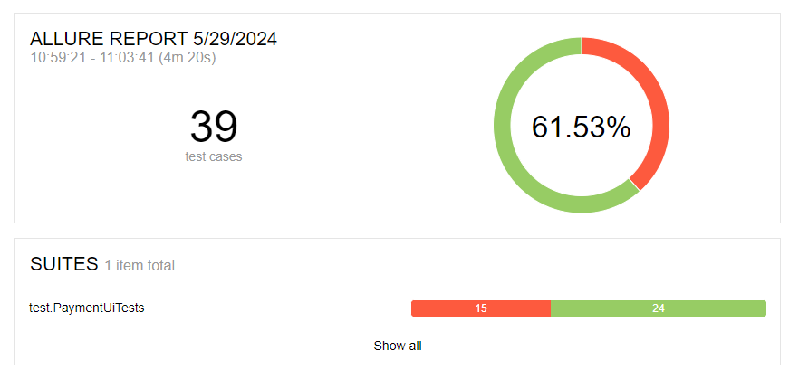

# Отчёт по итогам тестирования

Отчёт по результату автоматизированного тестирования функционала покупки по данным карты веб-сервиса покупки тура "Путешествие дня"

## Количество тест-кейсов

Всего было проведено 39 автотестов. Общий процент успешных тестов равен 61.53%.

Количество тестов - 39.
Количество пройденных автотестов - 24 - 61,53%.
Количество упавших автотестов - 15 - 38,47%.
По результатам автотестов было составлено 15 issue.

# Общие рекомендации
1. Нужна техническая документация по проекту
2. Следует определить требования к валидным данным в документации, например, к имени владельца

