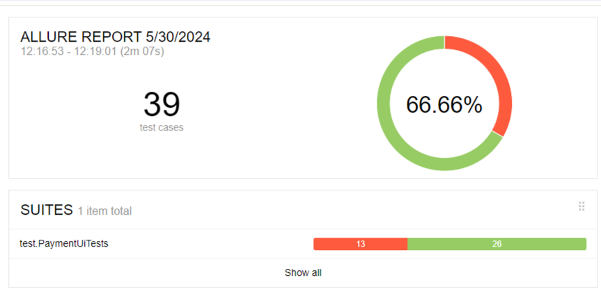

# Отчёт по итогам тестирования

Отчёт по результату автоматизированного тестирования функционала покупки по данным карты веб-сервиса покупки тура "Путешествие дня"

## Количество тест-кейсов

Всего было проведено 39 автотестов. Общий процент успешных тестов равен 66.66%.

Количество тестов - 39.  
Количество пройденных автотестов - 26 - 66,66%.  
Количество упавших автотестов - 13 - 33,34%.  
По результатам автотестов было составлено 13 issue.  

# Общие рекомендации
1. Нужна техническая документация по проекту
2. Следует определить требования к валидным данным в документации, например, к имени владельца

